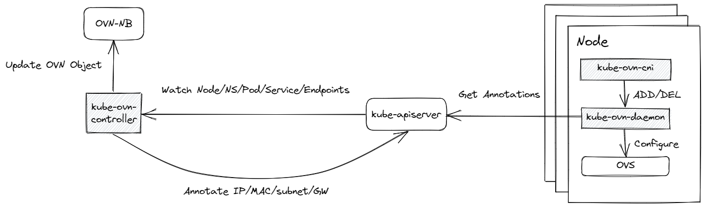

# IPAM CNI 插件调研（其二）

>来介绍一个比较特殊的 CNI 插件 [Kube-OVN](https://github.com/kubeovn/kube-ovn) 。


## Kube-OVN

### 核心架构



这里只说明了与 IPAM 机制强相关的组件，Kube-OVN 的全架构介绍可以参考[本文](https://github.com/kubeovn/kube-ovn/blob/master/ARCHITECTURE.MD)。

- `kube-ovn-controller`：*Deployment*，一个实现了选主的核心控制器，它监视 API Server 中所有与网络相关的事件，如 *Pod* 的创建删除、*Service* / *EndPoints* 的修改、*NetWorkPolicy* 的变更等，然后将它们转换为 OVN 逻辑网络的修改。IPAM 的逻辑同样由它维护，IP 分配的结果将写入 *Pod* 的注解中，供 kube-ovn-daemon 使用。
- `kube-ovn-daemon`：*DaemonSet*，完成所有真正涉及网络的工作，如处理 CNI 的 ADD/DEL 操作，完成 veth 设备对的创建与 OVS 的端口配置等。它完全通过 *Pod* 的注解来工作，注解由 kube-ovn-controller 创建与维护。
- `kube-ovn-cni`：CNI 二进制文件，充当 Kubelet 与 kube-ovn-daemon 之间的一个 **shim**。它实现了 CNI 协议，将由 Kubelet 传入的参数通过本地 Socket 传递给 kube-ovn-daemon。


### 相关机制

1. Kube-OVN 中，资源注解是非常重要的东西，注解的损坏会直接导致程序的错误。
2. Kube-OVN IPAM 是**集中式**的，**全局**的。
3. Kube-OVN IPAM 相关的所有能力，就是基于上述模型来实现的。即 kube-ovn-cni 传递 Kubelet 的参数；kube-ovn-controller 监听 API Server 事件，在相应的资源上打上注解；kube-ovn-daemon 根据注解完成具体网络操作。
4. Kube-OVN IPAM 的逻辑内嵌于 kube-ovn-controller 中，即它是没有按照标准 CNI 协议所约定的 *“插件链”*  形式来调用的。不过其 IPAM 能力还是可以搭配其他 Interface Plugin 使用（如 [macvlan](https://github.com/containernetworking/plugins/tree/main/plugins/main/macvlan)），这是通过代码中大量的 `if` 逻辑来实现的，**Kube-OVN 本身是没有实现 IPAM 插件的解耦的**。
5. 自然的，Kube-OVN 是不能搭配其他 IPAM 插件使用的。


## IPAM


### CRD

这里首先来介绍一下与 IPAM 相关的两个 CRD 和一些比较重要的代码中的结构体。

*Subnet* 是 Kube-OVN 中最核心的 CRD 之一，它限定了 *Pod* 分配 IP 的范围以及一些各类其他能力。可以把它类比于一个 IPAM 的 *“backend”*，不过它与一般的 IPAM CRD 后端最大的差异在于，*Subnet* 不会保存任何 IP 分配的信息，它只圈定范围。*Subnet* 支持租户级别的隔离。

这也正是 Kube-OVN 的特殊之处，其受限于 SDN 的架构，使得它的绝大部分功能都是通过上文中介绍的核心架构图里所描述的能力模型来实现的，结果就导致它有点像在利用注解（Annotations）来作数据库的意思。

```yaml
apiVersion: kubeovn.io/v1
kind: Subnet
metadata:
  name: ls1
spec:
  protocol: IPv4            # 支持 IPv4，IPv6，双栈三种模式
  cidrBlock: 10.66.0.0/16   # 子网 CIDR
  excludeIps:               # 被除外的 IP
  - 10.66.0.1..10.66.0.10
  gateway: 10.66.0.1
  namespaces:               # 可使用该子网的 namespace
  - ls1
```


对比一下 *Subnet* CR 在代码中所对应的数据结构，这里我将 IPv6 相关的以及 MAC 地址相关的字段注释了，因为其模型与 IPv4 类似或功能与 IPAM 无关。

```go
type Subnet struct {
    Name             string         // 子网名
    mutex            sync.RWMutex   // 内存读写锁，具体以写锁使用
    Protocol         string         // 支持 IPv4，IPv6，双栈三种模式
    V4CIDR           *net.IPNet     // 子网 CIDR

    V4FreeIPList     IPRangeList    // 可用 IP 地址
    V4ReleasedIPList IPRangeList    // 已释放的 IP 地址
    V4ReservedIPList IPRangeList    // 除外的 IP 地址

    V4NicToIP        map[string]IP  // 记录 IP 分配关系的三个 map
    V4IPToPod        map[IP]string
    PodToNicList     map[string][]string

    // V6CIDR           *net.IPNet
    // V6FreeIPList     IPRangeList
    // V6ReleasedIPList IPRangeList
    // V6ReservedIPList IPRangeList
    // V6NicToIP        map[string]IP
    // V6IPToPod        map[IP]string

    // NicToMac         map[string]string
    // MacToPod         map[string]string
}
```

比较需要关注的就是 `V4FreeIPList`，`V4ReleasedIPList`，以及三个记录 IP 分配关系的 map。之前也提到了，Kube-OVN IPAM 不需要将 IP 的分配关系持久化到特定 CR，它会选择在 kube-ovn-controller 每次启动时扫描 *Pod* 以及其他相关资源，进而通过它们的注解来初始化上述结构体中的字段；在此之后的 IP 分配流程也会基于纯内存来操作，而不太涉及 CR 的读写，很简单的道理，因为 IP 的分配信息已经被写到对应 *Pod* 的注解上了。


第二个比较重要的 CRD 就是 *IPs*。这里注释掉了多网卡相关的以及 MAC 相关的字段。

```go
type IP struct {
    metav1.TypeMeta   `json:",inline"`
    metav1.ObjectMeta `json:"metadata,omitempty"`

    Spec IPSpec `json:"spec"`
}

type IPSpec struct {
    PodName       string   `json:"podName"`
    Namespace     string   `json:"namespace"`
    NodeName      string   `json:"nodeName"`
    Subnet        string   `json:"subnet"`

    IPAddress     string   `json:"ipAddress"`
    V4IPAddress   string   `json:"v4IpAddress"`
    V6IPAddress   string   `json:"v6IpAddress"`

    ContainerID   string   `json:"containerID"`

    // AttachSubnets []string `json:"attachSubnets"`
    // AttachIPs     []string `json:"attachIps"`

    // MacAddress    string   `json:"macAddress"`
    // AttachMacs    []string `json:"attachMacs"`
}
```

其含义不难理解。可以非常清晰的看出 *IPs* 定义了 IP 的分配关系，而在实际的 CNI ADD/DEL 流程中，*IPs* 确实是会伴随着 IP 分配与回收而被创建或删除，不过特殊的是，*IPs* 却并没有参与 *“筛选未使用 IP，排除已用 IP”* 这类逻辑，而是仅用于更新 *Subnet* 的 `Status` 状态，比如当前 IPv4 地址可用数等。


### 锁

在具体介绍 IP 分配流程之前，先来了解一下 Kube-OVN IPAM 中设计的相关锁机制。把握住一个关键点，**全局串行**。

Kube-OVN 的 IPAM 逻辑是内嵌在 kube-ovn-controller 中的，不排除 kube-ovn-controller 的选主逻辑的话，Kube-OVN IPAM 总共有以下 **4** 把锁：

- kube-ovn-controller 选主，确保了 IPAM 在同一时间段内仅有单实例运作，使得 IPAM 基于内存 + 内存锁的工作模式可行。

- 控制器中的 *Pod* 锁，互斥锁。

  ```go
  type Controller struct {
      ipam        *ovnipam.IPAM
      podKeyMutex *keymutex.KeyMutex
      // ...
  }
  ```

- IPAM 中的互斥锁。

  ```go
  type IPAM struct {
      mutex   sync.RWMutex
      Subnets map[string]*Subnet
  }
  ```

- Subnet 中的互斥锁。

  ```go
  type Subnet struct {
      Name  string
      mutex sync.RWMutex
      // ...
  }
  ```


可以清楚的看到，上述三个结构体呈**嵌套**的结构；同时它们都持有一把内存互斥锁。这里来依次说说它们的作用。

1. kube-ovn-controller 监听 *Pod* 的相关事件，并通过命令交互 OVN-NB 来定义相关逻辑网络。控制器中的 *Pod* 锁即用于处理 *Pod* 的 ADD 与 DEL 事件所带来的并发问题。

2. IPAM 中的锁用于隔离 *Subnet* 的更新与 IP 分配流程。

   一个简单的场景，此时 A 在修改 *Subnet* 的相关字段，调整了该子网所圈定的范围；B 同时间创建了 *Pod*，且需要向 IPAM 申请 IP，这时它需要在内存的 Subnet 结构体中选出一个 IP，不过此时的内存结构体已经属于脏数据。

   上锁之后，*Subnet* 资源的修改与 IPAM 串行，*Subnet* 资源的调整会被控制器 `Watch`，进而修改内存中的 Subnet 结构体，避免了 IPAM 流程中的脏读。

3. Subnet 锁就非常好理解了，Subnet 可以类比于一个全局的内存 IP 池，属于集群范围的共享资源，当多个 *Pod* 在同时创建时，它们可能都在同一 Subnet 中挑选 IP，修改 Subnet 结构体，这是需要并发安全的。


一些个人理解。

在上述说明中，其实只有 IPAM 锁与 Subnet 锁是与 IPAM 强相关的，且在具体的 IPAM 流程中，会有嵌套上锁这种逻辑，即外层上了 IPAM 锁，内层又加了 Subnet 锁。

其实 IPAM 结构体也是全局唯一的，Subnet 作为其字段，在外部结构体已被锁住的情况下，再上锁其实意义已经不大，因为如果没有 IPAM 锁，仅有 Subnet 锁，那就可以实现多子网的并发 IP 分配；而当 IPAM 已被锁住时，其实就已经保证了全局串行。

不过 IPAM 锁与 Subnet 锁虽然功能存在冲突，但是其本质的职能与应用场景还是存在上述说明中的差异的。


### IP 分配算法

Kube-OVN IPAM 的逻辑是与 Kube-OVN 自身深度耦合的，所以不能片面的仅仅介绍 IPAM 如何工作。接下来我们经由一个 *Pod* 被创建的时间顺序，从全局的视角来看看一个 IP 到底是如何被分出来的。


#### (A)-IPAM 初始化

1. kube-ovn-controller  选主。
2. 控制器进入主逻辑流程，完成各类初始化工作，我们仅关注 IPAM 的初始化。
3. `List` 所有 *Subnet* 资源，将其依次维护至 Subnet 结构体，进而添加到 IPAM 结构体的 Subnet 数组中。
4. `List` 所有 *Pod* 资源，根据仍然存活 *Pod* 的注解信息初始化各 Subnet 结构体中的 IP 分配关系 map。
5. `List` 所有 *IPs* 资源，根据其 `Spec` 信息继续更新各 Subnet 结构体中的 IP 分配关系 map。
6. `List` 所有 *Node* 资源，同样的根据 *Node* 信息更新各 Subnet 结构体中的 IP 分配关系 map（Kube-OVN 维护 *join 子网*  来负责 *Node* 到 *Pod* 的通信，所以 *Node* 也需要从相应 *Subnet* 下分配 IP，进而应用至 `ovn0` 接口）。


#### (B)-*Subnet* 被创建/修改

1. 现在来尝试创建/修改一个 *Subnet* 资源，Kube-OVN 本身是提供了默认 *Subnet* 的。

2. kube-ovn-controller `Watch` 到 *Subnet* 资源的 Add/Update 事件，执行相关 `handle` 逻辑。

3. `List` 持有 *Subnet* 名字对应标签的 *IPs* 资源，根据其持久化的当前 *Subnet* 下的 IP 分配情况，来修改 *Subnet* 相关的 `Status` 信息，即更新了当前 *Subnet* 中，IPv4/IPv6 IP 的使用数量，剩余数量等字段。

   ```go
   type SubnetStatus struct {
       AvailableIPs    float64 `json:"availableIPs"`
       UsingIPs        float64 `json:"usingIPs"`
       V4AvailableIPs  float64 `json:"v4availableIPs"`
       V4UsingIPs      float64 `json:"v4usingIPs"`
       V6AvailableIPs  float64 `json:"v6availableIPs"`
       V6UsingIPs      float64 `json:"v6usingIPs"`
       // ...
   }
   ```

4. 更新 IPAM 结构体中维护的 Subnet 数组，确保下一次 IP 分配时不会脏读。

5. 通知 *Namespace* 资源的 Worker 根据 *Subnet* 资源中 `namespaces` 字段所定义的可用名称空间数组进行相关绑定。最终 *Namespace* 资源上会打上相应的注解，以表示其可用的 *Subnet* 集合。


#### (C)-*Pod* 被创建

1. 接下来，我们通过命令行或其他方式创建了一个 *Pod*。
2. kube-ovn-controller `Watch` 到 *Pod* 资源的 Add 事件， 执行相关 `handle` 逻辑。
3. 借由 B-3 步骤中的 *Subnet* `Status` 与 B-5 步骤中的 *Namespace* 注解进入 *“选池”* 流程。遵循以下优先级挑选待分配 IP 的 Subnet：
   - *Pod* 注解中若直接指明要使用的 *Subnet*，那么选择它。
   - *Pod* 注解中未指明 *Subnet*，则尝试在 *Pod* 所处的 *Namespace* 资源上检索相应注解。
   - *Namespace* 资源的注解中可以指定多个待选 *Subnet*，按顺序依照其 `Status` 信息判断当前 *Subnet* 是否仍有足够的 IP，若符合条件，则返回它；否则，尝试判断下一个 *Subnet*。
4. 根据返回的 *Subnet* 信息，由 IPAM 逻辑开始分配 IP：
   - 判断相关记录 IP 分配信息的注解是否已经有值，如果存在，进入分配指定 IP 的流程（Kube-OVN 静态 IP 能力）；否则，进入正常随机分配流程。
   - 通过 Subnet 结构体中维护的 IP 分配关系 map 判断是否存在 IP 分配冲突。
   - 遍历  `V4FreeIPList`，优先从其中挑出一个 IP；若 `V4FreeIPList` 已耗尽，则遍历 `V4ReleasedIPList` 挑选 IP。选出 IP 后，将该 IP 从  `V4FreeIPList` 或 `V4ReleasedIPList` 中剔除（IP 会在被释放时写入 `V4ReleasedIPList`，`V4ReleasedIPList` 与 `V4FreeIPList` 的能力非常重叠）。
   - 最终成功分配到了一个 IP，将 IP 分配的记录信息维护至 Subnet 结构体中的 IP 分配关系 map。
5. 将分配的 IP 地址以及其他相关信息，以注解的形式维护至 *Pod* 资源上。


#### (D)-kube-ovn-daemon 工作

1. D 与 C 以异步的方式同时执行，互不干扰。
2. Kubelet 在执行完相关前置步骤后开始调用 CNI 插件为待建容器构建网络。
3. Kube-OVN 二进制文件将 Kubelet 的入参经由本地 Socket 传递给 kube-ovn-daemon。
4. kube-ovn-daemon  响应 HTTP 请求，开始执行 ADD 流程。
5. 查询待操作 *Pod* 的资源信息，检查其注解是否初始化完成。若 kube-ovn-controller 还未完成其相关工作，*Pod* 上存在相关注解缺失，那么执行 `sleep`，然后重试。
6. 成功加载各注解信息后，创建相对应的 *IPs* 资源。
7. *IPs* 资源的 Add 事件从而被 kube-ovn-controller `Watch`，进而修改对应 *Subnet* 资源的 `Status` 信息，减少该子网下的可用 IP 数量。
8. 最后，kube-ovn-daemon 按注解中的要求进行真正的网络操作。


## 小结

1. Kube-OVN 功能非常丰富，代码比较凌乱。
2. 资源注解在 Kube-OVN 中有着很重要的地位，不过注解能轻易的被破坏与修改。
3. IPAM 未能与 main CNI Plugin 解耦，代码内嵌严重，各方面都不太遵守 CNI 协议。
4. *Subnet* 居然有双栈模式，IPv4 和 IPv6 的地址放一起管理，肉眼可见的累。导致相关结构体的字段都是双倍，各种方法实现也比较冗长，不合理的设计。
5. *Subnet* 与 *IPs* 的 CRD 设计，有参考意义，*“维护当前可用 IP 集合”* 这个行为其实是非常有必要的。
6. 锁机制可以忽略。通过各种初始化的流程，将 *Pod* 的数据全全加载到内存中的做法没有什么优雅可言。
7. 一类资源的不同事件回调居然配合了多个 workqueue 来工作，这真的不会存在问题吗？


